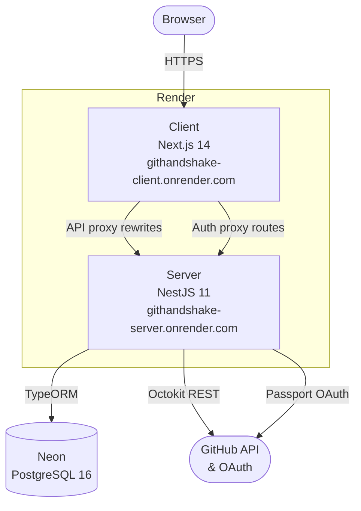
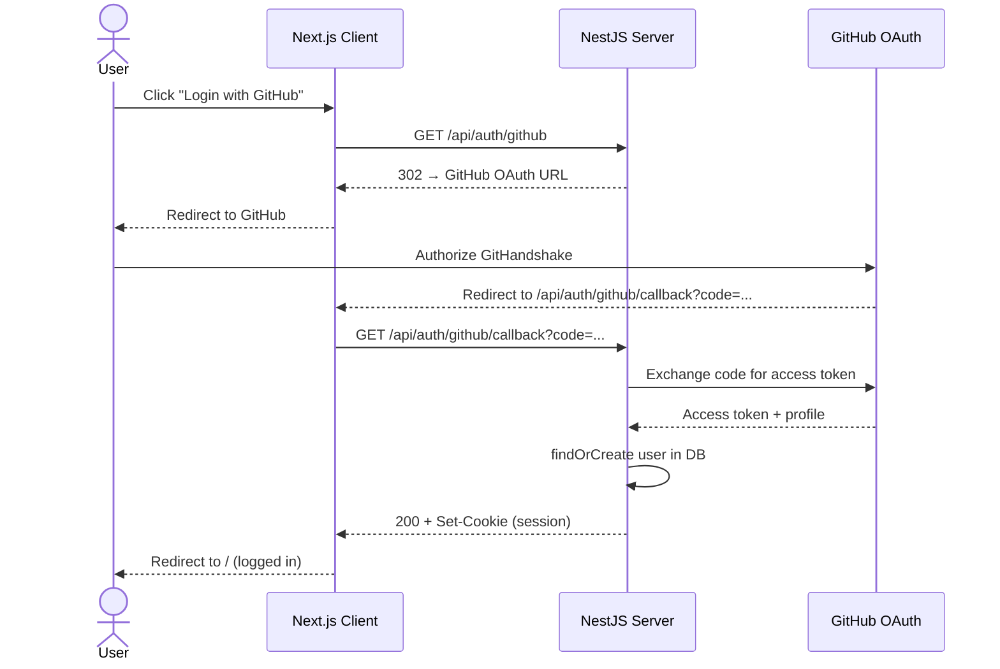
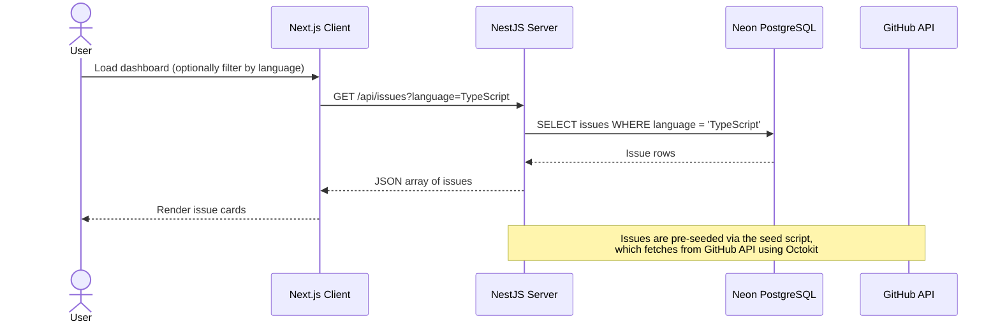

# GitHandshake — Architecture

## System Overview



---

## Auth Flow



---

## Data Flow — Issues



---

## Monorepo Structure

```
GitHandshake/               ← Turborepo root
├── apps/
│   ├── client/             ← Next.js 14 (deployed on Render)
│   │   ├── app/
│   │   │   ├── api/auth/   ← Auth proxy routes (cookie forwarding)
│   │   │   └── page.tsx    ← Dashboard
│   │   └── components/
│   └── server/             ← NestJS 11 (deployed on Render)
│       └── src/
│           ├── auth/        ← Passport GitHub OAuth + sessions
│           ├── issues/      ← Issues CRUD + GitHub fetch
│           ├── github/      ← GitHub App integration
│           └── users/       ← User entity + findOrCreate
├── db/
│   └── schema.sql          ← Database schema
└── docs/                   ← Documentation
```
