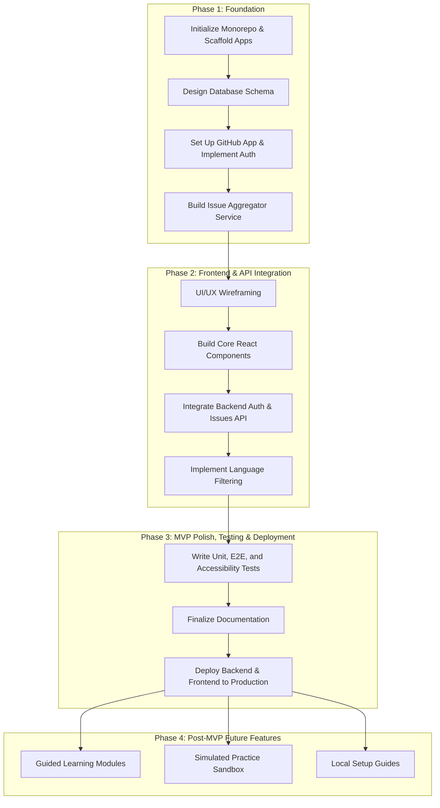

# 🚀 Open Source Navigator - Development Roadmap

This document outlines the phased development plan for the **Open Source Navigator** web application, with an initial focus on delivering the Minimum Viable Product (MVP): **The "First Contribution Finder"**.

---

## Visual Roadmap Flow

---

## Phase 1: Foundation & Core Backend (Weeks 1-3)

**Goal:** Establish the project's technical foundation, including the backend services required for authentication and data aggregation.

| Task | Description | Key Technologies |
| :--- | :--- | :--- |
| **1. Initialize Monorepo** | Set up a monorepo using npm workspaces to manage the frontend and backend codebases in a single repository. | `npm` |
| **2. Scaffold Applications** | Create the initial project structures for the `client` (Next.js) and `server` (NestJS) applications within the `/apps` directory. | `Next.js`, `NestJS` |
| **3. Design Database Schema**| Define the initial PostgreSQL schema for `users` (storing GitHub profile info) and `issues` (storing aggregated issue data). | `PostgreSQL` |
| **4. Set Up GitHub App** | Register a new GitHub App to handle authentication and API access, ensuring permissions are minimal and tokens are short-lived. | `GitHub Apps` |
| **5. Implement Authentication**| Build the backend authentication flow, allowing users to log in securely via the GitHub App. | `NestJS`, `Passport.js` |
| **6. Build Issue Aggregator**| Develop a backend service that periodically fetches beginner-friendly issues from the GitHub API (e.g., tagged `good first issue`, `help wanted`).| `NestJS`, `GitHub API` |

---

## Phase 2: Frontend Development & API Integration (Weeks 4-6)

**Goal:** Build the user-facing interface and connect it to the backend services.

| Task | Description | Key Technologies |
| :--- | :--- | :--- |
| **1. UI/UX Wireframing** | Design simple, clean wireframes for the main dashboard, focusing on the issue list and filtering controls. | - |
| **2. Build Core Components** | Develop the primary React components, such as `IssueCard`, `IssueList`, `LanguageFilter`, and `LoginButton`. | `React`, `Next.js` |
| **3. Implement Frontend Auth**| Connect the frontend to the backend's authentication endpoints, managing user sessions and login/logout states. | `Next.js`, `React Context`|
| **4. Integrate Issue API** | Fetch and display the aggregated issues from the backend on the main dashboard. | `React Query` / `SWR` |
| **5. Implement Filtering** | Enable users to filter the displayed issues by programming language, a key feature of the MVP. | `React` |
| **6. Style with Accessibility**| Apply utility-first styling and integrate accessible component primitives to ensure a modern look and feel. | `Tailwind CSS`, `Radix UI` |

---

## Phase 3: MVP Polish, Testing & Deployment (Weeks 7-8)

**Goal:** Refine, test, and deploy the MVP to make it available for initial users.

| Task | Description | Key Technologies |
| :--- | :--- | :--- |
| **1. Write Unit & E2E Tests**| Implement unit tests for backend services and frontend components. Set up end-to-end tests for critical user flows like login and filtering. | `Jest`, `Cypress` |
| **2. Accessibility Audit** | Integrate and run `axe-core` checks within the testing pipeline to catch accessibility violations automatically. Target WCAG 2.1 AA compliance. | `Axe-Core` |
| **3. Finalize Documentation**| Create a comprehensive `README.md` with instructions for local setup, development, and deployment. | `Markdown` |
| **4. Deploy Application** | Deploy the backend server and the frontend application to production-ready hosting platforms. | `Vercel`, `Heroku`/`Render`|

---

## Phase 4: Post-MVP Future Features

**Goal:** Expand the application's functionality based on the broader vision outlined in the project proposal.

| Feature | Description |
| :--- | :--- |
| **1. Guided Learning Modules** | Introduce interactive tutorials covering Git essentials, project structures (`README`, `CONTRIBUTING.md`), and the PR lifecycle. |
| **2. Simulated Practice Sandbox**| Create a dedicated dummy repository where users can practice making pull requests and receive automated feedback. |
| **3. Local Setup Guides** | Build a community-sourced collection of guides for setting up local development environments for various tech stacks. |
| **4. Enhanced Filtering & Search** | Add advanced capabilities to filter issues by project, organization, or recent activity, and implement a full-text search feature. |
